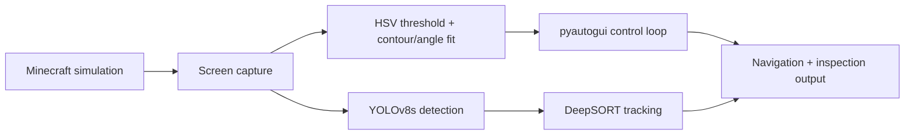

# AUV Simulation for Underwater Pipeline Inspection

A computer-vision pipeline that detects corrosion, tracks it frame to frame, and steers a simulated AUV along a subsea pipeline — built entirely inside Minecraft, standing in for real underwater footage.

## Overview

Subsea pipeline inspection is usually done with divers or ROVs. Both are expensive, slow, and limited by depth and weather. AUVs are a cheaper, more scalable alternative — if they can perceive and follow a pipeline on their own.

Testing that on a real AUV wasn't practical for a student project, so we built the pipeline and the underwater environment in Minecraft instead. A custom world with a corroded pipeline stood in for real subsea footage. We recorded runs, extracted frames, and trained vision models on them exactly as we would on real sensor data.

## How it works

The system runs two things off the same video feed:

1. **Corrosion detection and tracking.** YOLOv8s detects corrosion patches frame by frame. DeepSORT tracks each patch across frames, so the same corrosion spot keeps one ID instead of being re-detected as new.
2. **Pipeline segmentation and navigation.** HSV thresholding isolates the pipeline from the background. A minimum-area rectangle fit to the resulting contour gives the pipeline's centerline and angle. `pyautogui` sends keyboard and mouse input to Minecraft to keep the character centered on and aligned with the pipe. A Hough line transform runs alongside it as a secondary edge check.



## Dataset

- 1,775 frames extracted from screen recordings of the simulated pipeline environment
- Annotated in Roboflow, single class: `corrosion`
- Augmented to ~3,500 images with ±15° rotation
- Split 70 / 20 / 10 across train / validation / test

## Training and results

YOLOv8s, 640×640 input, batch size 16, scheduled for 120 epochs and early-stopped at epoch 78. Recall at that point was around 0.50 — some corrosion patches were missed — while precision and mAP@0.5 held up well over the run, which is why training was cut there instead of running the full schedule.

HSV segmentation held up well under consistent lighting, with occasional false positives where rust patches were close in hue to the background. DeepSORT kept stable IDs on tracked corrosion across frames, which is what let the navigation loop correct heading as a tracked patch drifted in-frame.

## Repository contents

| File | Description |
|---|---|
| `Final_Code` | Pipeline segmentation and navigation controller (HSV thresholding, contour/angle fitting, Hough lines, `pyautogui` control of Minecraft) |
| `Demo_Sample.mp4` | Recording of a working navigation run |
| `Trial_Error.mp4` | Recording of a run that hit one of the failure modes below |
| `AUV simulation for underwater pipeline inspection.pdf` | Project slide deck — problem statement, methodology, dataset, results |
| `NUS Report Work.pdf` | Internship report |

YOLOv8s training and DeepSORT tracking were run separately (Roboflow-hosted training / a notebook not included here). Only the navigation controller ships as code in this repo.

## Running `Final_Code`

```bash
pip install opencv-python pyautogui numpy
```

1. Open the Minecraft world with the constructed pipeline.
2. Position the window so the pipeline sits inside the capture region hardcoded in the script — top-left corner at (100, 100), 700×500 px. Edit the `region` variable near the top of the file if your resolution or window placement differs.
3. Run the script, then switch to the Minecraft window during the 5-second startup delay:

```bash
python Final_Code
```

4. Three OpenCV windows open live: the HSV binary mask, the Hough-line overlay, and the main view with the fitted bounding box and orientation angle. Press `q` in any window to stop.

`pyautogui` needs OS-level permission to read the screen and send input. On macOS, grant Accessibility and Screen Recording access. On Linux, it needs an X11 session — Wayland isn't supported.

## Limitations

- The Minecraft–Python interface was unstable at times, noted in the project report as a compatibility issue between the game and the control script.
- Some data was lost during frame collection and annotation.
- HSV ranges and the capture region are tuned to one texture pack and one window position. Moving to a different setup means re-tuning both.

## Team

Built during a research internship at the National University of Singapore, June 2025, under the guidance of Dr. Amirhassan Monajemi.

Roland Singh, Ayush Upadhyay, Khushi J. H., Kirat Singh, Tarun Malathi Raja.

## References

1. https://www.tandfonline.com/doi/full/10.1080/08839514.2022.2146853
2. https://www.sciencedirect.com/science/article/pii/S2667143323000215
3. https://link.springer.com/article/10.1007/s12559-024-10377-y
4. https://www.sciencedirect.com/science/article/pii/S2352484723011502
5. https://www.sciencedirect.com/science/article/pii/S2667143325000149
